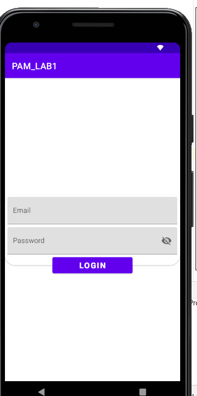
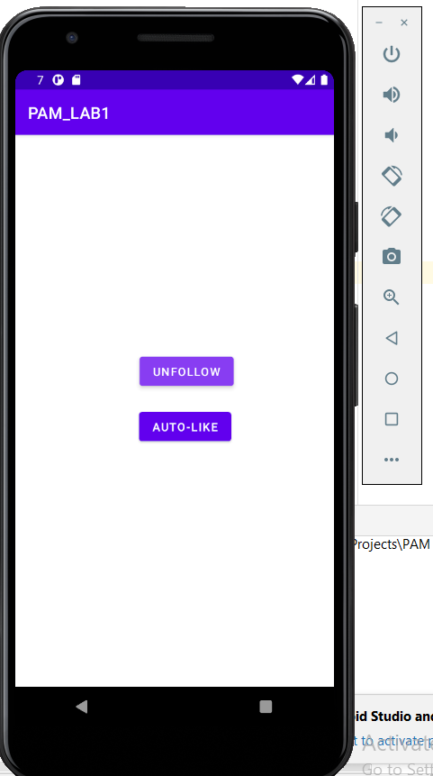
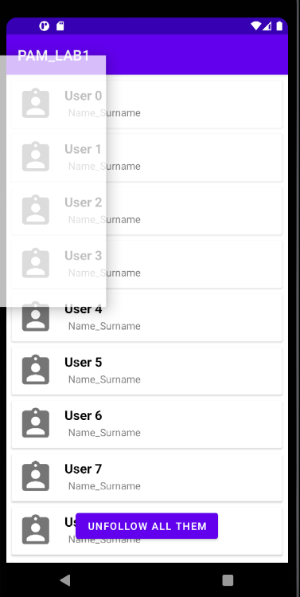
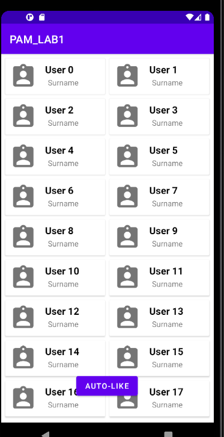
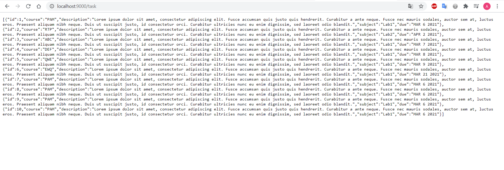
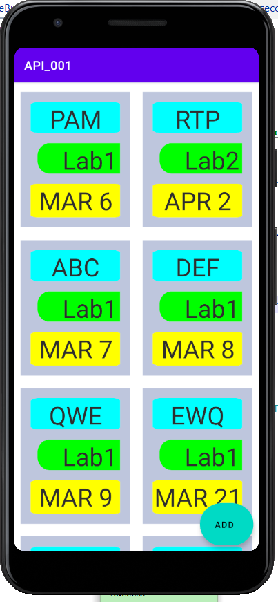
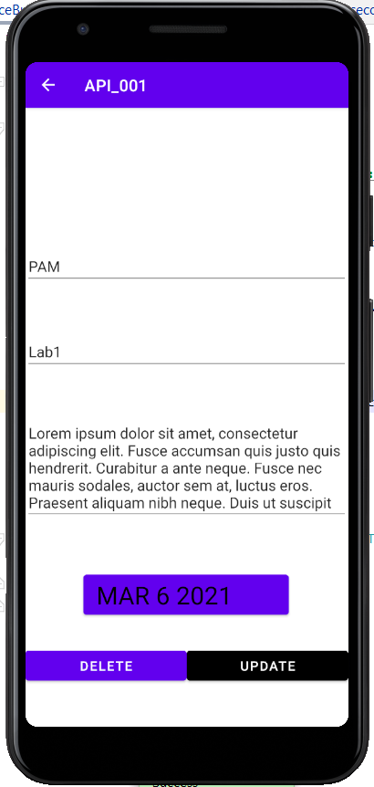
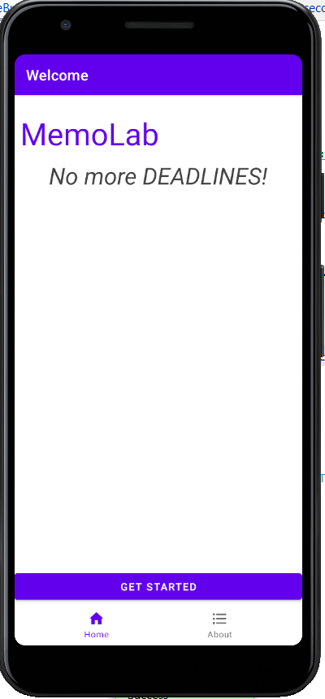
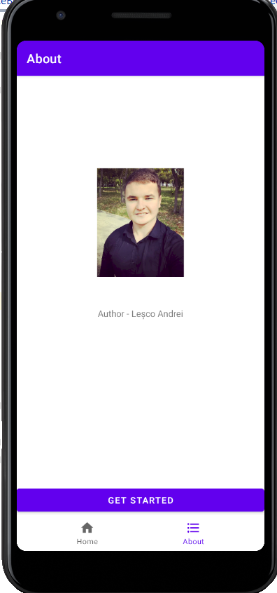

#PAM
---
# Laboratory work No. 1 - App basic setup
---
## Author : Lesco Andrei
---
In laboratory work No.1 I was performing basic setup of mobile application on Android.

# Laboratory work task performed:

 - Created mobile application on Android
 - Createated 2 screens which transfer data from one screen to another
- Performed some data changes to data I have received in screen No. 2 and pass it back to screen No. 1
- Added buttons for changing activities, edit text field for performing input manipulations and handled behaviour using functions from controller.
- Changed Icon of the app to custom one

# Example of behaviour handling
    override fun onDestroy() {
        super.onDestroy()
        Toast.makeText(getApplicationContext(),"Come back later", Toast.LENGTH_SHORT).show();
    }
    
# Example of action handling using intent
    fun next(view: View){
        val input = inputText.text.toString()
        val intent = Intent(this,Activity2::class.java)
        intent.putExtra("input",input)
        startActivity(intent)
    }

LAB 2 : Instagram Utility
App functions to implement in furthure labs:
1) Show the persons who do not follow you, but you follow them
2) Auto-Like photos of the persons in the list
3) For influencers to like all photoes of a random person from the persons who follows him (as an award for winning in a contest)
4) I am thinking to implement the functionality of sending messages broadcast to groups of people,but not being part of a group. Like sending general holiday congratulations like "Happy New Year", or inviting people to a party without reavealing who didn't accepted 

In laboratory work No.2 I have implemented basic layout and UI for my mobile application.

# Laboratory work task performed:

 - Picked the theme for my app, and it is Instagram Helper Utility.
 - Added 4 functional screens: sign in page, main menu, unfollow page and auto-like page

In "unfollow" and auto-like page I am using RecyclerView to display a list of people
In "auto-like" I have used GridLayoutManager to make it with 2 columns

# Login Page

# Main Menu Page

# Unfollow Page

# Auto-like Page

Lab 3: Implementing API layer

# Laboratory work task performed:
 - I have created a server on localhost in order to recieve the API.
 # API
 
 - Implemented 2 POST (gets all tasks, gets a specific task by id), 1 PUT(updates a task) 1 DELETE(deletes the task) requests in this lab.
# API examples 
     interface DestinationService {
     
         @GET("task")
         fun getDestinationList(@QueryMap filter: HashMap<String, String>): Call<List<Destination>>
     
         @GET("task/{id}")
         fun getDestination(@Path("id") id: Int): Call<Destination>
     
         @POST("task")
         fun addDestination(@Body newDestination: Destination): Call<Destination>
     
         @FormUrlEncoded
         @PUT("task/{id}")
         fun updateDestination(
                 @Path("id") id: Int,
                 @Field("course") course: String,
                 @Field("description") desc: String,
                 @Field("subject") subject: String,
                 @Field("due") due: String
         ): Call<Destination>
     
         @DELETE("task/{id}")
         fun deleteDestination(@Path("id") id: Int): Call<Unit>
     }
 - The api requests are implemented using Retrofit and kotlin coroutines
 #Coroutine call
         CoroutineScope(IO).launch {
             loadDestinations()
         }
 #Retrofit
     private const val URL = "http://10.0.2.2:9000/"
 
     // Create Logger
     private val logger = HttpLoggingInterceptor().setLevel(HttpLoggingInterceptor.Level.BODY)
 
     // Create OkHttp Client
     private val okHttp = OkHttpClient.Builder().addInterceptor(logger)
 
     // Create Retrofit Builder
     private val builder = Retrofit.Builder().baseUrl(URL)
         .addConverterFactory(GsonConverterFactory.create())
         .client(okHttp.build())
 
     // Create Retrofit Instance
     private val retrofit = builder.build()
 
     fun <T> buildService(serviceType: Class<T>): T {
         return retrofit.create(serviceType)
     }
 
 - Added required screens in order to complete the app logic
  
  
 - Added tab bar navigation
  
  
 